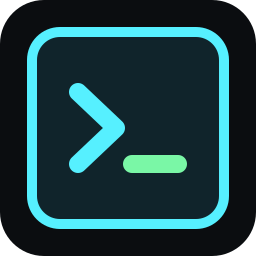

# Cortex



Cortex is a Windows-first, local-first terminal workspace manager for projects that need organized PowerShell, CMD, WSL, notes, snippets, and repeatable local session setup.

It is a desktop app, not a cloud service. Cortex does not include AI features, telemetry, analytics, cloud sync, or background external API calls.

## Demo

Add real manually recorded assets here when they are ready:


```text
docs/assets/cortex-demo.gif
docs/assets/cortex-screenshot.png
```

Suggested Windows recording tools:

- ScreenToGif for short UI GIF demos.
- ShareX for screenshots and quick captures.

Keep demo assets reasonably small. Do not commit large binary recordings unless they are intentional release-quality assets.

## Website

The product landing page lives in `website/` so it can be deployed independently from the Tauri desktop app.

Run it locally:

```powershell
npm run website:dev
```

Build it:

```powershell
npm run website:build
```

Add website screenshots and videos under:

```text
website/public/media/
```

The page already looks for:

```text
website/public/media/video-geral.mp4
website/public/media/video-geral.webm
website/public/media/1.png
website/public/media/2.png
website/public/media/3.png
website/public/media/4.png
website/public/media/5.png
```

The numbered images may also use `.jpg`, `.jpeg`, or `.webp`.

For Vercel, import this repository and set the project root directory to `website`. Keep Windows installers and executable bundles in GitHub Releases instead of committing them into the repository. The website reads public releases from:

```text
https://api.github.com/repos/devjuliusotto/cortex/releases
```

Release assets ending in `.exe`, `.msi`, `.msix`, `.zip`, or `.7z` are listed automatically on the website, including current and older versions.

## Features

- Windows ConPTY terminal sessions for PowerShell, CMD, and WSL Ubuntu.
- Per-workspace default terminal paths with OneDrive and spaces supported.
- Per-session cwd snapshots so existing terminals keep their original path.
- Real persisted split panes with horizontal and vertical splits.
- Draggable split dividers with per-workspace layout restore.
- Local workspace notes beside terminal tabs.
- Workspace-specific command snippets with paste/run actions.
- Optional Marketplace structure for future workspace templates.
- Per-workspace colors and auto-start settings from the sidebar context menu.
- Local terminal scrollback persistence with bounded storage.
- Manual GitHub issue flow only; no background uploads.

## Installation

Download the latest Windows installer from GitHub Releases:

```text
https://github.com/devjuliusotto/cortex/releases
```

Unsigned Windows builds may trigger Microsoft SmartScreen warnings. Code signing is not configured yet, so Windows may ask you to confirm that you trust the installer.

## Development Setup

Requirements:

- Windows 10 or newer with ConPTY support.
- Node.js 20 LTS recommended.
- Rust stable through `rustup`.
- WSL Ubuntu installed if you want the WSL Ubuntu profile.

Install dependencies and run the Tauri app:

```powershell
npm install
npm run tauri:dev
```

Frontend-only development is available for UI work:

```powershell
npm run dev
```

## Build

Run the frontend build:

```powershell
npm run build
```

Check Rust:

```powershell
cd src-tauri
cargo check
```

Build desktop bundles:

```powershell
npm run tauri:build
```

Release artifacts are written under:

```text
src-tauri/target/release/bundle/
```

## Release Process

Release builds are prepared through the Windows GitHub Actions workflow in `.github/workflows/release.yml`.

To publish a release:

1. Update the version in `package.json`.
2. Update the version in `src-tauri/tauri.conf.json`.
3. Keep `package-lock.json` and `src-tauri/Cargo.toml` synchronized.
4. Commit the release changes.
5. Create the matching version tag:

```powershell
git tag vX.Y.Z
git push origin vX.Y.Z
```

The Tauri installer filenames are driven by `src-tauri/tauri.conf.json`.

## Privacy And Local-First Model

Cortex stores workspace, session, layout, snippet, note, profile, scrollback, and window metadata locally in the operating system app data directory. User state is not stored in the Git repository.

Cortex does not provide:

- Telemetry.
- Analytics.
- Tracking.
- Cloud sync.
- AI features.
- Background external API calls.
- In-app payment or donation popups.

Manual update checks contact GitHub Releases only when the user chooses to check for updates. Feedback opens a GitHub issue page in the browser; Cortex does not submit anything automatically.

Terminal history can contain sensitive text if it was printed in the shell. Be careful when using shared Windows accounts or backing up the app data directory.

## Workspaces

In Cortex, workspace and project mean the same thing. Each workspace owns:

- `defaultWorkingDirectory`
- `color`
- `autoStartTerminalsOnOpen`
- command snippets
- notes and terminal session metadata
- persisted split layout

Right-click a workspace in the left sidebar to open its context menu. From there you can select, rename, color, duplicate, delete, set or clear the default terminal path, and toggle terminal auto-start.

New terminals snapshot the current workspace path into the terminal session `cwd`. Changing the workspace default later affects only new terminals. Existing sessions keep their saved cwd.

If the saved path is invalid, Cortex shows a warning and starts the shell in the user home directory. WSL converts Windows paths such as `C:\Projects\App` to `/mnt/c/Projects/App` where possible.

## Split Panes

Use the split buttons in the tab bar to split the active pane right or down. Each pane points to a terminal tab or note tab. Drag the divider to resize. Split trees and ratios are persisted per workspace and restored on restart.

## Command Snippets

Use the snippet toolbar inside a workspace to create, edit, delete, paste, or run snippets. Snippets are stored on the workspace object and never run without an explicit click.

## Marketplace

Advanced workspace templates are intentionally not part of the default Cortex workspace UI. The Marketplace keeps a placeholder for `Workspace Templates (Coming Soon)` so project-specific templates can become optional add-ons later.

Archived template definitions remain behind a disabled Marketplace flag for future reuse. Cortex does not download remote templates, execute remote code, or run template commands automatically.

## Roadmap

- Safer persistent terminal runtime through a local daemon or tray process.
- More ergonomic pane management.
- Import/export workspace profiles.
- Additional local templates.
- Signed Windows installer.

See `docs/persistent-terminal-runtime.md` for the persistent PTY runtime design.

## Contributing

Contributions are welcome. Keep changes aligned with the local-first product model:

- No telemetry or analytics.
- No cloud sync.
- No background network calls.
- No AI features unless explicitly scoped in a future roadmap issue.
- No secrets in the repository.

Before opening a PR, run:

```powershell
npm run build
cd src-tauri
cargo check
```

Call out user-visible terminal, persistence, installer, and privacy changes in PR descriptions.

## Support

[](https://www.buymeacoffee.com/YOUR_USERNAME)

Maintainer note: replace `YOUR_USERNAME` in this README and `.github/FUNDING.yml` before publishing donation links. Do not add payment code or donation popups inside the app.

## License

Cortex is licensed under GPL-3.0. See `LICENSE`.
